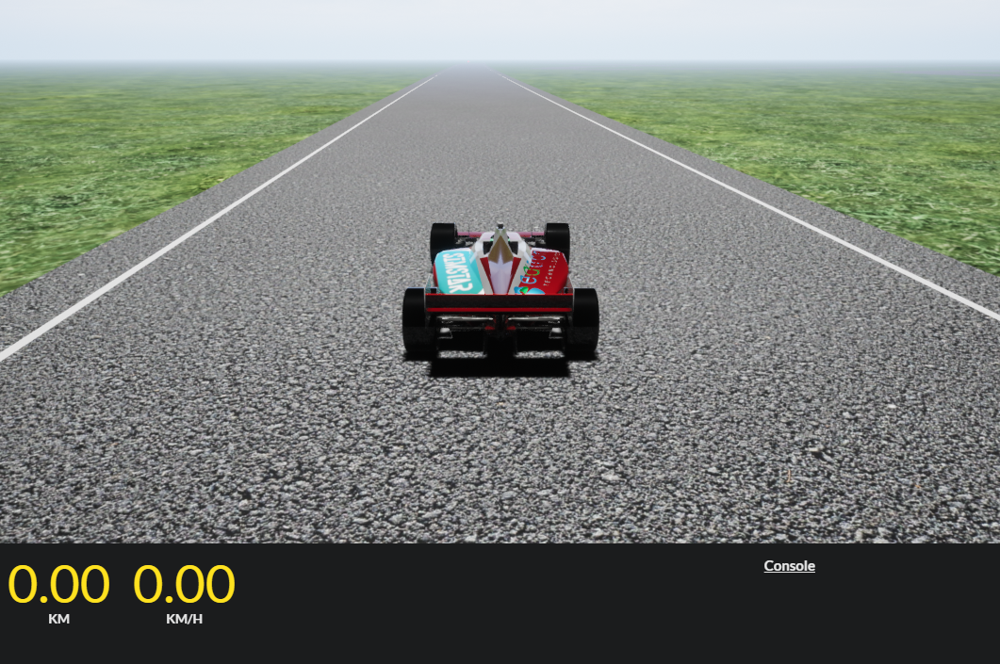
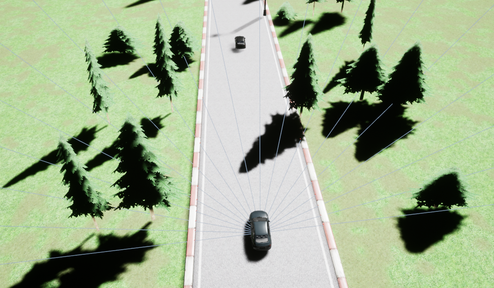
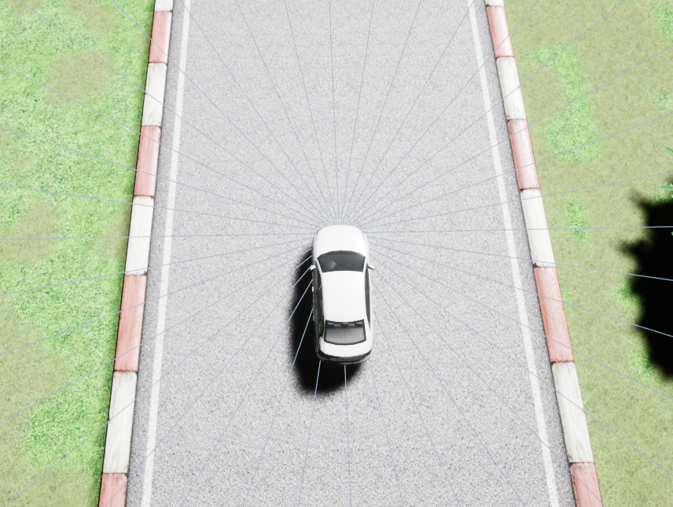

# Deep Reinforcement Learning Final Racing Project
Final Project of Istanbul Technical University BLG-638E (Deep Reinforcement Learning) Lecture

## Racing Demonstration


## How to set up

### Simstar

- Install Simstar using the drive link below to download v2.1.1
  ```
  https://drive.google.com/drive/folders/1dVXsVtvj7-e9WsC_dOMl4J36X5niuWXw
  ```

#### Windows

- Just click on Simstar.exe and Simstar is ready.

#### Linux

- Install Vulkan Libraries
  ```
  sudo apt-get install vulkan-utils
  ```

- Run below commands to make Simstar executable
    - To run Simstar without rendering, use -RenderOffScreen flag
    - To change Simstar's port, use -api_port=XXXX flag
    ```
    cd Simstar
    chmod 777 -R *
    ```
    - Simstar has to be running during training or evaluation.
    ```
    ./Simstar.sh
    ```
    - Open Simstar without rendering.
    ```
    ./Simstar.sh -RenderOffScreen
    ```
    or
    ```
    ./Simstar.sh -nullrhi
    ```

## Requirements

### Python Package Requirements

#### Option 1: Install using Anaconda
Create a new environment using anaconda. 
```
conda create --name simstar-env python=3.8
```
```
conda activate simstar-env
```

#### Option 2: Install using pip
	
Install required python libraries from requirements.txt by
```
pip install -r requirements.txt
```

### Python

- Install the requirements
  ```
  pip install -r PythonAPI/requirements.txt
  ```
- Install Simstar client from inside PythonAPI using
  ```
  python setup.py install
  ```

## Pytorch Version

The final evaluation will be using pytorch version 1.11 and CUDA version 10.2.

## Installation Test

There are multiple stages that needs to be checked.

### 1. Test Simstar Executable

Open the simstar executable, allow for networking if asked.



### 2. Sensors

* a) Speed Sensor:
    * Vehicle's lateral and longitudinal velocity in km/h.
    * Resultant normalized velocity is given to the observation state at each step.

* b) Track Sensor:
    * It get the limits of the road ends with radar reflections.
    * An agent could be able to identify the road curvature and boundaries.
    * The observable distance is between 0.2 meters and 200 meters.
    * Field-of-view of the track sensor is 190 degrees.
    * The size of the observation is 19-dimensional list of normalized scalar values. As a result, each scalar represents a radar output of 10 degrees angle in 2D plane.



* c) Angle Sensor:
    * Vehicle's deviation angle from road's center lane in radians.
    * Left and right deviations from the track's center lane is positive and negative respectively.

* d) Opponents Sensor:
    * It is similar to that of a Track Sensor, but it gets radar reflections from only other racing vehicles (agents).
    * By using this sensor, an agent will have an observation of other vehicles' distance and angle of presence in terms in vectoral state.
    * The observable distance range is 20 meters.
    * Field-of-view of the track sensor is 216 degrees.
    * The size of the observation is 18-dimensional list of normalized scalar values. As a result, each scalar represents a radar output of 12 degrees angle in 2D plane.



* e) Track Position Sensor:
    * Vehicle's lateral deviation from the road's center lane in meters.

**NOTE**:
* The sensor locations, constants, and parameters **should not** be changed or modified as during the evaluation or training of the models. Given sensor calibrations and constants will be used.
* A final evaluation of the models will be similar to that of given in 'training_example/evaluate.py'.
* For being fair, it is required that a size of the observation space **are not changed** during training and evaluation.
* The order of observation space variables are also **should be fixed**.
* Initial positions of other opponent vehicles could be changed as desired during training; however during the final evaluation, opponent vehicles will be models of other teams so the position of those each agent vehicle is determined by lap time.

### 3. Test Environment Setup

```
cd training_example
```
```
python train.py
```
